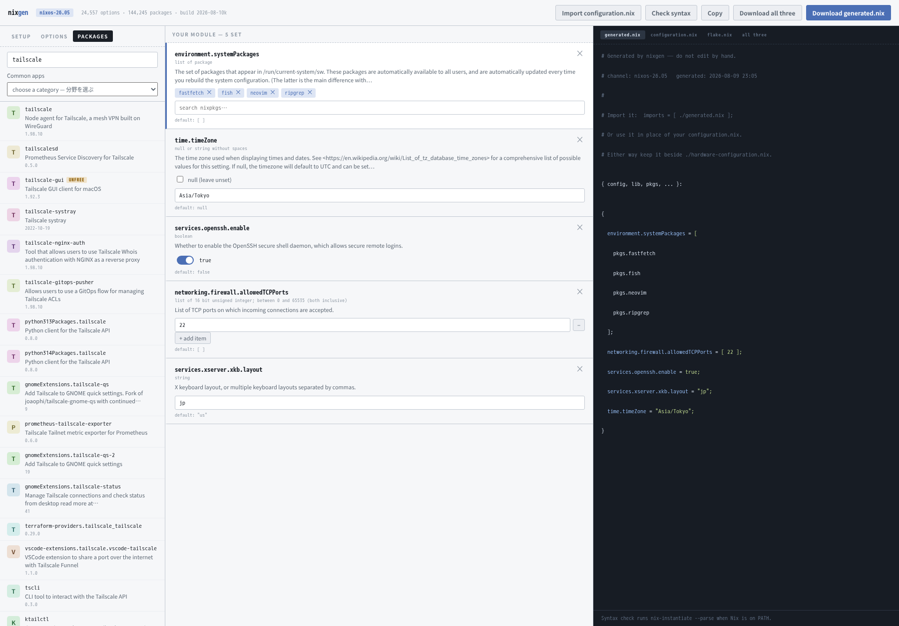

# nixgen

A search box and a form for your NixOS configuration. Look through 24,517
settings and 144,200 pieces of software, tick the boxes and fill in the fields,
and get a configuration file you can use straight away.



日本語版: [README.ja.md](./README.ja.md) ·
Homepage: <https://hatake716.github.io/nixgen/>

> **This is a beta.** It works on the author's own machine and in a virtual
> machine, but nobody knows what it does anywhere else. Always check with
> `dry-build` (below) before applying anything.

---

## What it does

On NixOS you write your system's settings into a file. To turn on SSH, you
write this:

```nix
services.openssh.enable = true;
```

The catch is that **you cannot write anything without knowing the name of the
setting**, and there are 24,517 of them. The official documentation is a long
page you have to search through every time.

nixgen does that part for you:

1. type `ssh` into the search box
2. click `services.openssh.enable` in the results
3. flip the switch on
4. a file appears on the right containing `services.openssh.enable = true;`

You do not have to remember the name. Any word that comes to mind will find it.

### Who it is for

- **People who cannot keep the names in their head.** The less often you use a
  setting, the more time you spend looking it up
- **People new to NixOS.** When you do not yet know what *can* be configured,
  typing words into a search box and reading what comes back works as a map
- **People who just upgraded.** Load your current file and **settings that no
  longer exist are highlighted**

### Who it is not for

- **People who know the names and would rather type them.** This will only slow
  you down
- **People not running NixOS.** Sorry — this is NixOS-only

---

## Installing

You need NixOS, or Nix on another Linux. **You do not need to download
anything.**

### Step 1 — Turn on flakes

"Flakes" is the newer way of writing Nix. This tool uses it, so it has to be
switched on first. A fresh NixOS install has it switched off.

Check whether you already have it:

```bash
nix flake --help
```

**If a page of help text appears, you are set.** Skip to step 2.

If it complains about an experimental feature, open your configuration file
(`/etc/nixos/configuration.nix`) and add this line between the `{` and the `}`:

```nix
nix.settings.experimental-features = [ "nix-command" "flakes" ];
```

Save it, then apply it to the system:

```bash
sudo nixos-rebuild switch
```

Run `nix flake --help` again. Help text means it worked.

### Step 2 — Start it

```bash
nix run github:hatake716/nixgen
```

**That is the whole thing.** No download, no install step. Nix collects what it
needs and starts the program.

**The first run takes about five minutes.** Behind the scenes it:

1. sets up a Python environment
2. downloads the list of NixOS settings and software (about 10 MB)
3. builds a search database (about 37 MB) in `~/.local/share/nixgen`
4. deletes the raw data it no longer needs
5. opens <http://127.0.0.1:8823/> in your browser

You should see three panes: search on the left, input fields in the middle, the
file taking shape on the right. Type `openssh` into the search box and click the
top result — if a line appears on the right, everything is working.

Press **Ctrl-C** in the terminal to stop. Later runs start in about a second,
because the database is already built.

**Not seeing a change you expected?** Nix remembers where `github:` points for
an hour, so a run started soon after an update can still be the previous
version. Force a re-check:

```bash
nix run --refresh github:hatake716/nixgen
```

The build id in the header tells you which one you are on.

### Step 3 — Keep it around (optional)

So you can start it by typing `nixgen`:

```bash
nix profile install github:hatake716/nixgen
nixgen
```

**A copy installed this way is pinned** — it stays as it is until you say
otherwise:

```bash
nix profile upgrade nixgen
```

Remove it later with `nix profile remove nixgen`.

### Step 4 — Use the file it made

Press **Download generated.nix** at the top right and save the file next to the
`configuration.nix` you already have — usually in `/etc/nixos/`.

Then open `configuration.nix` and add one line to the `imports` list:

```nix
{
  imports = [
    ./hardware-configuration.nix
    ./generated.nix          # <- add this line
  ];
}
```

That means "read the contents of `generated.nix` as settings too". **Nothing
inside your original `configuration.nix` is touched.**

Check that it holds together before applying it:

```bash
sudo nixos-rebuild dry-build
```

If there are no errors, apply it for real:

```bash
sudo nixos-rebuild switch
```

**To undo everything, delete that one line and run `switch` again.** Nothing
else changed, so you get exactly your old system back.

### If something goes wrong

**`experimental Nix feature 'nix-command' is disabled`**
Step 1 was skipped, or `nixos-rebuild switch` has not been run yet.

**`does not contain a 'flake.nix', searching up`**
or **`Path 'build' does not exist in Git repository`**
You are running inside a folder managed by git — `/etc/nixos` is the usual one.
Flakes only look at files git already knows about, so anything untracked might
as well not exist. Using the `github:` form above avoids this entirely.

**`Address already in use`**
Something else is on port 8823. Pick another:

```bash
nixgen --port 9000
```

**The browser did not open**
Open <http://127.0.0.1:8823/> yourself. The terminal prints the same address.

**You want to start over**
Delete the database and run it again; it will be rebuilt.

```bash
rm -rf ~/.local/share/nixgen
```

---

## Using it

### Finding things

Nobody can scroll through 24,517 entries, so **search is the way in.**

Type a service name and the setting you want is normally at the top. `firewall`
puts `networking.firewall.enable` first; `ssh` puts `services.openssh.enable`
first.

The tabs run **Setup**, **Options** (settings), **Packages** (software) — in the order you would use them on a new machine. Setup is where the app opens; click **Options** to start searching.
Anything you pick under Packages is added to the list of programs to install.

Ticking *Hide options that need hand-written Nix* narrows the list to **the
settings that have a proper input field** — 88.3% of them. The rest need you to
write a piece of Nix yourself, and hiding them keeps things simpler while you
are learning.

Package lists come out in alphabetical order — on import, and as you add to
them. Nix does not care about the order, but a sorted list is far easier to
read and produces a much smaller diff when you change one entry.

### Loading your existing configuration.nix

Press **Import configuration.nix** and pick your file. Your current settings
appear in the form. **The file you choose is only ever read, never written to.**

Each setting lands in one of four groups. All four end up in the output, so
nothing is lost:

| Group | What it means |
|---|---|
| **Filled into the form** | Turned into an editable field. Most settings land here |
| **Verbatim — module structure** | Lines like `imports`. Not settings as such, but removing them would stop your other files from being read, so they are copied across |
| **Verbatim — an expression** | Things like `lib.mkIf ...`, where the value depends on a condition. A form cannot express that, so it is copied exactly as written |
| **Verbatim — not in this release** | Settings that were removed or renamed when NixOS moved on |

**Copied lines are shown in a different colour** and carry a `# verbatim` note
at the end, so you can still spot them after downloading.

Watch the fourth group especially. **A setting that no longer exists will be
rejected by `nixos-rebuild`.** Keeping it and highlighting it is the point —
so you notice.

### Starter files for a new machine

For when you have just installed NixOS and do not have a `flake.nix` yet.

The **Setup** tab produces the two files you need: a `configuration.nix` that
reads in your generated settings, and a `flake.nix` that assembles the system.
Switch between them with the tabs at the top right and download each one.

Everything in them is editable from the screen:

| Field | What it is |
|---|---|
| Host name | The name of the machine |
| Main user | Your everyday account. Untick to leave user setup out entirely |
| nixpkgs release | The current numbered release or one of the two before it. `flake.nix` is pinned to this |
| Architecture | `x86_64-linux` for an ordinary PC |
| Boot loader | systemd-boot for a UEFI machine, GRUB for an older BIOS one (it will ask which disk) |
| NetworkManager | Manages network connections. Unticking removes the line |
| Flakes | The feature you switched on in step 1 |
| Groups | Which groups the account belongs to. `wheel` is what allows `sudo` |
| `system.stateVersion` | **The NixOS version you first installed. Do not raise it to match a newer one** |

**Unticking something removes its lines entirely** rather than commenting them
out, so the file stays as short as what you actually asked for.

### When the same setting appears in both files

The starter `configuration.nix` and `generated.nix` can end up setting the same
thing. **Those lines turn red, and the field is marked "also in
configuration.nix".**

Usually that is fine. The starter writes its lines with `lib.mkDefault`, which
means "use this unless something else says otherwise" — so `generated.nix` wins.

It becomes a problem when **both** sides use `lib.mkDefault`. Then they have
equal priority and NixOS refuses to guess:

```
error: The option `networking.hostName' has conflicting definition values
```

Delete the line from whichever file you do not want it in.

### What "Check syntax" can and cannot tell you

The **Check syntax** button finds places where the file is **broken as Nix** —
an unclosed bracket, a missing semicolon.

It does **not** check whether the values make sense. Put a word where a number
belongs and this check will still pass.

Only `sudo nixos-rebuild dry-build` can tell you that. **Always run it before
applying.**

### Reading it in another language

The screen is an ordinary web page, so your browser's translation works on it.
In Chrome, right-click and choose *Translate to…*.

**Only the descriptions are translated.** Setting names, package names and the
contents of the generated file stay in English — a translated
`services.openssh.enable` would no longer be a valid setting.

### Options when starting it

```bash
nixgen                       # same as nix run github:hatake716/nixgen
nixgen --port 9000           # use a different port
nixgen --no-browser          # do not open a browser
```

| Variable | Default | What it does |
|---|---|---|
| `NIXGEN_DATA` | `~/.local/share/nixgen` | where the database lives |
| `NIXGEN_CHANNEL` | `nixos-26.05` | which release's settings to work with |

The easier way to change release is the **nixpkgs release** field in the Setup
tab. Picking one that has not been indexed yet offers to build it — a few
minutes the first time, instant on later switches, because each release keeps
its own database. Your choice is remembered across restarts.

`NIXGEN_CHANNEL` still decides which release is built on a first run:

```bash
rm -rf ~/.local/share/nixgen
NIXGEN_CHANNEL=nixos-25.11 nixgen
```

**Numbered releases only** for now — see *What it cannot do* for why.

### Using it from another computer

This tool **has no login.** It is set to accept connections only from your own
machine (`127.0.0.1`); please leave it that way.

If you want to reach it from elsewhere, tunnel it over SSH:

```bash
ssh -L 8823:127.0.0.1:8823 the-other-machine
```

Then open <http://127.0.0.1:8823/> on the computer in front of you.

---

## How it works (optional reading)

None of this matters if you just want to use the thing.

### The list of settings is not hand-written

NixOS publishes **machine-readable data for every setting, for every
release**:

```
https://channels.nixos.org/nixos-26.05/options.json.br
https://channels.nixos.org/nixos-26.05/packages.json.br
```

Name, type, default, description, which file declares it. The official manual is
built from the same data. Everything nixgen knows comes from there — **there is
not a single hand-written entry.**

### The hard part is the type

Each setting's type is written as **a sentence for humans, not a format a
program can read**, and there are 1,247 different ones:

```
"boolean"
"null or (list of string)"
"16 bit unsigned integer; between 0 and 65535 (both inclusive)"
"attribute set of (submodule)"
```

Reading those sentences is what decides whether you get a switch, a number box,
a dropdown or a list. **21,652 of the 24,517 settings (88.3%) get a proper input
field.** The rest fall back to a box where you write Nix by hand.

Most of those, though, are containers holding other settings — and the ones
inside are individually editable, so the share you really have to hand-write is
below 12%.

### Search ranking

Results are grouped by how the query matched the name, then sorted by depth and
by whether the last part is `.enable`.

The thing that does the work is **matching whole segments**. `firewall` puts
`networking.firewall.enable` above `services.firewalld.enable` because in the
first one `firewall` is a complete dot-separated piece, not just some letters
inside a longer word.

### How we know it does not produce broken files

Everything the tool writes is checked **against the real Nix parser**. Eight
thousand randomly chosen settings per run, filled with awkward values — quotes,
backslashes, newlines, empty strings, Japanese text — and every run parses.

Three real bugs came out of that:

| Bug | What it was |
|---|---|
| Name placeholders are not all alike | Not just `<name>` but also `<n>` and `*`. 5,080 settings (21%) have one |
| `[ -1 ]` is a syntax error | Negative numbers inside a list need brackets around them |
| `if` and `rec` are reserved words | Using them as names requires quoting |

The starter files get the same treatment: they are **assembled all the way into
a complete NixOS system** to prove they hold up.

---

## What it cannot do

**The unstable channel.** `nixos-unstable` does publish the same option data, so
this is not impossible — it is unfinished. The problem is that the channel
always serves its newest snapshot while your `flake.lock` pins one commit, and
unstable moves every day. The form would offer settings the commit you build
does not have. **Check syntax would still pass**, and the failure would only
turn up at `nixos-rebuild`, which is the least helpful place for it to appear.

There is a way out: every channel publishes a `git-revision`, so the flake could
be pinned to the exact snapshot that was indexed. That, plus showing how old an
index is, is what unstable support would need. It is not built yet.

Mixing channels is a separate thing and stays out of scope. Packages could be
pulled from unstable through an overlay, but options cannot — an unstable
`services.foo.*` needs unstable's module set — and a tool where half the
catalogue is selectable and half is not would be worse than no support at all.

**Writing back to your original file.** It can read one; it will not write to
one. Replacing values while preserving the existing layout and comments is a far
harder problem, and getting it wrong breaks a working system. **Read-only is
what makes importing safe.**

**Judging whether a value is right.** That is `nixos-rebuild dry-build`'s job.

**Setting a whole container at once.** You can set
`services.nginx.virtualHosts.<name>.root`, but not `services.nginx.virtualHosts`
as one lump.

---

## Development

```bash
git clone https://github.com/hatake716/nixgen.git
cd nixgen
nix develop                                  # python3, brotli, curl, sqlite
./build/fetch-data.sh nixos-26.05
python3 build/build_index.py --channel nixos-26.05
python3 build/server.py
```

This puts the database in `./data/` instead of your home directory and runs the
files you are editing. Clone it somewhere outside any existing git repository —
same reason as under *If something goes wrong*.

```
build/
  nixgen_core.py    reads the type sentences, writes the Nix (no dependencies)
  nix_import.py     reads an existing configuration.nix
  starter.py        the Setup tab's configuration.nix and flake.nix
  releases.py       which releases exist, and building an index for one
  build_index.py    published data -> SQLite + full-text search
  server.py         HTTP server, standard library only
  fetch-data.sh     downloads the published data
  static/           the screen (plain JavaScript, no build step)
data/
  nixgen.sqlite     the database it builds, not in git
docs/
  index.html        the homepage, served by GitHub Pages from /docs
  screenshot*.png
CHANGELOG.md        every release; English half, then Japanese half
flake.nix
flake.lock          pins the nixpkgs version
```

`docs/index.html` is self-contained and already points at this repository. If
you fork it, change the `hatake716` links inside and point
**Settings → Pages** at `main` / `/docs`.

---

## Changelog

See [CHANGELOG.md](CHANGELOG.md) — English first, Japanese in the second half.

The version you are running is printed in the header of the app, next to the
option counts. **If a fix does not seem to have landed, check that number
first** — an old copy being served looks exactly like a broken fix.

---

## License

MIT — see [LICENSE](LICENSE). **The files it generates are yours.** The licence
covers the tool, not its output.

Not affiliated with the NixOS project.
