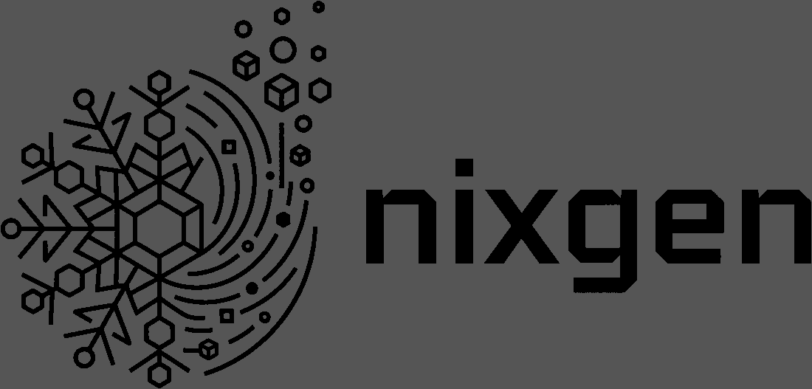

# nixgen

<picture>
  <source media="(prefers-color-scheme: dark)" srcset="docs/logo-white.png">
  
</picture>

**From a fresh install to a machine you can use — without knowing a single
option name.** Search all 24,557 settings and 144,245 packages, fill in values
with widgets that know the type, and get a configuration file you can read
before anything on your machine changes.

> [!NOTE]
> **You are reading the `development` branch — the experimental one.** Every
> command below names it (`github:hatake716/nixgen/development`), so what you
> install is what this page describes. Stable is
> [`main`](https://github.com/hatake716/nixgen/tree/main), which is what the
> plain `github:hatake716/nixgen` resolves to; its README leaves the branch
> off. Work lands here first and moves to `main` once it has held up, so
> anything on this page may be newer than what `main` will do.


### Three reasons

**1. A desktop that works on the first login.** GNOME, KDE Plasma, Xfce,
Cinnamon, COSMIC, LXQt, i3, and two Wayland compositors that arrive with a
shell already on them — Sway + noctalia and niri + noctalia. Enabling a
desktop is one line
anyone can write. What nobody tells you is the rest: the greeter and its
Wayland mode, the session name NixOS checks at build time, XWayland, the
shell's autostart unit and the PATH it needs to launch anything, the terminal
its default config asks for by name, the keyring, the bar that would otherwise
appear twice. Every one of those was found by running a real machine and
hitting the failure.

**2. Japanese, set up all the way through.** Locale, console keymap, and the
keyboard layout for X *and* Wayland — two different settings, and the Wayland
one is an environment variable nothing documents. Then fcitx5 with mozc, its
front end matched to the session your desktop actually runs. The app itself
says everything in both languages, and guards option paths from machine
translation: a translated `services.openssh.enable` is not valid Nix.

**3. Nothing on your machine changes until you say so.** nixgen writes new
files and never edits yours; a `configuration.nix` you import is only ever
read. It has no privileged endpoint at all — the server *cannot* change your
system, because a local server with no authentication is a door any page in
your browser could knock on. It hands you one command instead, you read the
file first, `dry-build` before you switch, and the files it replaces stay
beside the new ones.

Because of the third, the first two are worth trying: a desktop you can switch
away from cleanly is a desktop you can afford to try.

日本語版: [README.ja.md](./README.ja.md) ·
Homepage: <https://hatake716.github.io/nixgen/>

> **Release candidate for 1.0.** What it generates is checked on every push —
> the renderer and importer harnesses, and an eleven-point sweep driving the
> real app in a browser — and before a release the generated bundle is
> evaluated as an actual NixOS system and its claims read back out of it.
> Tested on the author's own machines: NixOS only, x86_64 by default.
> **Always run `sudo nixos-rebuild dry-build` before you switch** — nixgen
> cannot judge types, and only your machine can tell you the rest.

---

## What it does

On NixOS you write your system's settings into a file. To turn on SSH, you
write this:

```nix
services.openssh.enable = true;
```

The catch is that **you cannot write anything without knowing the name of the
setting**, and there are 24,557 of them. The official documentation is a long
page you have to search through every time.

nixgen does that part for you:

1. type `ssh` into the search box
2. click `services.openssh.enable` in the results
3. flip the switch on
4. a file appears on the right containing `services.openssh.enable = true;`

You do not have to remember the name. Any word that comes to mind will find it.

### Who it is for

- **People who cannot keep the names in their head.** The less often you use a
  setting, the more time you spend looking it up
- **People new to NixOS.** When you do not yet know what *can* be configured,
  typing words into a search box and reading what comes back works as a map
- **People who just upgraded.** Load your current file and **settings that no
  longer exist are highlighted**

### Who it is not for

- **People who know the names and would rather type them.** This will only slow
  you down
- **People not running NixOS.** Sorry — this is NixOS-only

---

## Installing

You need NixOS, or Nix on another Linux. **You do not need to download
anything.**

### Step 1 — Turn on flakes

"Flakes" is the newer way of writing Nix. This tool uses it, so it has to be
switched on first. A fresh NixOS install has it switched off.

Check whether you already have it:

```bash
nix flake --help
```

**If a page of help text appears, you are set.** Skip to step 2.

If it complains about an experimental feature, open your configuration file
(`/etc/nixos/configuration.nix`) and add this line between the `{` and the `}`:

```nix
nix.settings.experimental-features = [ "nix-command" "flakes" ];
```

Save it, then apply it to the system:

```bash
sudo nixos-rebuild switch
```

Run `nix flake --help` again. Help text means it worked.

### Step 2 — Start it

```bash
nix run github:hatake716/nixgen/development
```

**That is the whole thing.** No download, no install step. Nix collects what it
needs and starts the program.

**The first run takes about five minutes.** Behind the scenes it:

1. sets up a Python environment
2. downloads the list of NixOS settings and software (about 10 MB)
3. builds a search database (about 37 MB) in `~/.local/share/nixgen`
4. deletes the raw data it no longer needs
5. opens <http://127.0.0.1:8823/> in your browser

You should see three panes: search on the left, input fields in the middle, the
file taking shape on the right. Type `openssh` into the search box and click the
top result — if a line appears on the right, everything is working.

Press **Ctrl-C** in the terminal to stop. Later runs start in about a second,
because the database is already built.

**Not seeing a change you expected?** Nix remembers where `github:` points for
an hour, so a run started soon after an update can still be the previous
version. Force a re-check:

```bash
nix run --refresh github:hatake716/nixgen/development
```

The build id in the header tells you which one you are on.

### Step 2a — Put it in the application menu (experimental)

`nix run` starts it for as long as the terminal is open. If you would rather
click an icon, install it once:

```bash
nix profile install github:hatake716/nixgen/development
```

**nixgen then appears in your application menu, under System.** Starting it
from there opens the browser by itself — there is no terminal to keep open,
and nothing else to type.

Two things are worth knowing about the menu entry:

- **Closing the browser tab does not stop it.** The server keeps running. That
  is usually what you want, and clicking the icon again brings the page back
  rather than complaining — but if you want it stopped, stop it from the
  terminal you started it in, or log out.
- **The first launch still takes about five minutes**, because the database has
  to be built. Started from the menu there is no terminal to print progress to,
  so it puts up a desktop notification instead and opens the browser when it is
  ready. If you would rather watch it happen, run `nixgen` once in a terminal
  first.

There is no way to do this step from a GUI, and that is not an oversight on
nixgen's part: NixOS has no graphical package installer at all. Neither GNOME
Software nor KDE Discover manages system packages here. The command above is
the last one this tool needs — everything after it is the browser.

To update it later, or remove it:

```bash
nix profile upgrade nixgen
nix profile remove nixgen
```

**No branch on these two, and that is not an oversight.** They take the name
of the entry in your profile — which is `nixgen` — not a flake reference.
`nix profile upgrade nixgen/development` matches nothing and silently does
nothing. The branch is already recorded when you install: `nix profile list`
shows it as the *Original flake URL*, and upgrading follows it, so an entry
installed from `development` upgrades to the newest `development`.

### Step 3 — Build your configuration in the browser

The middle of the screen lists five steps, and they are the order the tabs are
used in. A first run, concretely:

1. On the **Setup** tab, type a name for the machine into **Host name** and
   your account into **Main user**, then pick your boot loader —
   **systemd-boot** for a UEFI machine, **GRUB** for an older BIOS one. The
   `configuration.nix` and `flake.nix` on the right rewrite themselves as you
   type.
2. Open **Options** and add settings. The dropdowns at the top handle the big
   ones in one go — a kernel, a shell, a desktop, a graphics driver, a
   language, Flatpak. For anything else, search: type `timeZone`, click the
   result, fill in the field that appears in the middle.
3. Open **Packages** and add software: search for `firefox` and click it, or
   pick a category under **Common apps**. Everything you click lands in
   `environment.systemPackages`.
4. Press **Check syntax** at the top right. It should answer `Parses cleanly.`
   If it reports a problem, fix it before going on.
5. Press **Download all three**. You get one archive, named after your host,
   holding the three files nixgen wrote.

Nothing you add is hidden: every setting is ordinary text in the files on the
right, and every card can be changed or removed again. The
[Using it](#using-it) section below describes each tab in detail.

### Step 4 — Put it on the machine

**On a new machine** — one still running the configuration the installer wrote
— unpack the archive and copy the three files in:

```bash
cd ~/Downloads        # or wherever the archive landed
tar -xzf desktop.tar.gz
sudo cp desktop/*.nix /etc/nixos/
```

(`desktop` is whatever you typed as the host name.) This overwrites the
`configuration.nix` that was there. `hardware-configuration.nix` — the file
that describes your disks — is not in the archive and stays as it is. The
**System update** button in the app runs these same steps for you, asking
before each one and keeping backups of what it replaces.

Check it, then apply it:

```bash
sudo nixos-rebuild dry-build
sudo nixos-rebuild switch
```

That first `switch` also turns flakes on. From then on the command is the one
the Setup tab prints:

```bash
sudo nixos-rebuild switch --flake /etc/nixos#desktop
```

**On a machine you already configure by hand**, take only `generated.nix` (the
**Download this file** button beside the file tabs), save it beside your own
`configuration.nix`, and add one line to your `imports` list:

```nix
{
  imports = [
    ./hardware-configuration.nix
    ./generated.nix          # <- add this line
  ];
}
```

Nothing else in your file is touched, and **deleting that one line undoes
everything** — run `switch` again and you have exactly your old system back.

### If something goes wrong

**`experimental Nix feature 'nix-command' is disabled`**
Step 1 was skipped, or `nixos-rebuild switch` has not been run yet.

**`does not contain a 'flake.nix', searching up`**
or **`Path 'build' does not exist in Git repository`**
You are running inside a folder managed by git — `/etc/nixos` is the usual one.
Flakes only look at files git already knows about, so anything untracked might
as well not exist. Using the `github:` form above avoids this entirely.

**`port 8823 is already in use`**
Most often it is nixgen itself, still running from earlier. Open
<http://127.0.0.1:8823/> and look at the build id in the header — if it is not
the version you expected, that is the old one answering, and stopping it with
**Ctrl-C** in the terminal it started from is all that is needed.

If something else has the port, pick another:

```bash
nixgen --port 9000
```

**The browser did not open**
Open <http://127.0.0.1:8823/> yourself. The terminal prints the same address.

**You want to start over**
Delete the database and run it again; it will be rebuilt.

```bash
rm -rf ~/.local/share/nixgen
```

**It is using more disk than you expected**
Each channel keeps its own index, about 37 MB. Rebuilding one replaces its file
rather than adding another, so this grows by one file per channel you have ever
picked and by nothing else.

```
~/.local/share/nixgen/
├── nixgen.sqlite                  the one built on the first run
├── nixgen-nixos-unstable.sqlite   one more each time you switch channel
├── nixgen-nixos-25.11.sqlite      about 37 MB apiece
└── CURRENT                        which channel you picked last
```

When a channel drops off the list its index can no longer be reached. The Setup
tab says how much it is taking and offers to remove it.

---

## Using it

Opening it puts **five steps** in the middle of the screen, and they are the
order to work in:

1. **Setup** — the machine itself, and the two starter files. Already have a
   `configuration.nix`? **Import configuration.nix** first.
2. **Options** — the settings.
3. **Packages** — the software.
4. **Check syntax** — fix whatever it reports.
5. **Download all three** — then `sudo nixos-rebuild dry-build` before you
   switch.

You can go back to any tab at any time; the order is where to start, not a door
that shuts behind you. Add anything and that panel becomes the thing you added.

**The [Getting started](#installing) walkthrough above already covers the whole
path from install to switch.** What follows is the reference: each tab, each
button, and the reasons behind them.

### Setup — starter files for a new machine

For when you have just installed NixOS and do not have a `flake.nix` yet.

The **Setup** tab produces the two files you need: a `configuration.nix` that
reads in your generated settings, and a `flake.nix` that assembles the system.
Switch between them with the tabs at the top right and download each one.

**Or take all three at once.** **Download all three** in the header hands you a
`.tar.gz` holding `configuration.nix`, `flake.nix` and `generated.nix` in a
directory named after the host. The last of the file tabs, **all three**, says
what is in it and downloads the same archive:

```bash
tar -xzf desktop.tar.gz
```

It is a `.tar.gz` rather than a `.zip` because NixOS ships `tar` and `gzip` and
does not ship `unzip`. `hardware-configuration.nix` is not in it — that one
describes this machine's disks and is yours. **Check syntax** on that tab
parses all three.

With all four in place it looks like this:

```
/etc/nixos/
├── flake.nix                   from Setup; the way in to the whole system
├── configuration.nix           from Setup; the hand-written half
├── hardware-configuration.nix  written when you installed; left alone
└── generated.nix               what you built under Options and Packages
```

`flake.nix` reads `configuration.nix`, which reads the other two. The command
that applies it is on the screen as well:

```bash
sudo nixos-rebuild switch --flake /etc/nixos#your-host-name
```

Everything in them is editable from the screen:

| Field | What it is |
|---|---|
| Host name | The name of the machine |
| Main user | Your everyday account. Untick to leave user setup out entirely |
| nixpkgs channel | The current numbered release, one of the two before it, or `nixos-unstable`. Whatever you pick, everything comes from it |
| What `flake.nix` points at | The release branch by default, so updates arrive. Or the exact commit the option list was read at, so what you build has the options you were offered and nothing else |
| Architecture | Fixed to `x86_64-linux` and hidden — the answer for practically every PC. Importing a `configuration.nix` that says otherwise brings the field back with that value |
| Boot loader | systemd-boot for a UEFI machine, GRUB for an older BIOS one (it will ask which disk) |
| NetworkManager | Manages network connections. Unticking removes the line |
| Flakes | The feature you switched on in step 1 |
| Groups | Which groups the account belongs to. `wheel` is what allows `sudo` |
| `system.stateVersion` | **The NixOS version you first installed. Do not raise it to match a newer one** |

**Unticking something removes its lines entirely** rather than commenting them
out, so the file stays as short as what you actually asked for.

### Setup — reading in the configuration.nix you already have

Press **Import configuration.nix** and pick your file. **The file you choose is
only ever read, never written to.**

**It lands in `configuration.nix`, not in the module.** That file is your
machine's own, and the one the Setup tab writes — so that is where your
settings go:

| What was in your file | Where it goes |
|---|---|
| Host name, user and groups, architecture, boot loader, NetworkManager, flakes, `system.stateVersion` | fields on the **Setup** tab, which write those lines |
| `imports` | merged into the imports list of the `configuration.nix` nixgen writes |
| everything else | **cards in the module**, where you can change them like anything else. An option this release does not have, or an expression a form cannot hold, arrives as a card you can read but not edit |

The module (`generated.nix`) is left alone: it is for what you add under
**Options** and **Packages** afterwards. If you add an option there that your
file also set, the line turns red and the status bar says which — the same
warning as for anything the Setup tab writes.

**The Options dropdowns show what the file chose.** After reading a
`generated.nix` back in, the Kernel, Shell, Desktop, Graphics, Language and
Region dropdowns are set to whatever that file had — read out of the settings
themselves, not from a memory of the click. **It selects, it never applies**:
the settings are already in the module, so nothing is written and nothing is
duplicated. A preset the file does not use, or a value nixgen does not list
(a time zone outside the eighteen), stays on `choose…` rather than being
guessed at.

**A `generated.nix` from an earlier session goes back the other way.** Press
**Import generated.nix**: its settings become cards in the module, which is
where they came from. That is the round trip for "closing the tab loses the
form" — download `generated.nix`, read it back later.

### When the same setting appears in both files

The starter `configuration.nix` and `generated.nix` can end up setting the same
thing. **Those lines turn red, and the field is marked "also in
configuration.nix".**

Usually that is fine. The starter writes its lines with `lib.mkDefault`, which
means "use this unless something else says otherwise" — so `generated.nix` wins.

It becomes a problem when **both** sides use `lib.mkDefault`. Then they have
equal priority and NixOS refuses to guess:

```
error: The option `networking.hostName' has conflicting definition values
```

Delete the line from whichever file you do not want it in.

### Options — finding things

Nobody can scroll through 24,557 entries, so **search is the way in.**

Type a service name and the setting you want is normally at the top. `firewall`
puts `networking.firewall.enable` first; `ssh` puts `services.openssh.enable`
first.

The tabs run **Setup**, **Options** (settings), **Packages** (software) — in the order you would use them on a new machine. Setup is where the app opens; click **Options** to start searching.
Anything you pick under Packages is added to the list of programs to install.

### Options — picking a kernel

**Options** has a **Kernel** dropdown: standard, latest, LTS or Zen. It writes
`boot.kernelPackages`, which is a raw option — its value is a Nix expression
rather than anything a form can hold — so what lands in the module is the
expression, in a box you can edit.

Each name is looked up in the package index before it is written, and the
status line names the version it found, so `LTS` says `linux 6.12.102` rather
than leaving you to guess which series that was. There is no
`linuxPackages_lts` in nixpkgs; LTS is a list of series, newest first, and the
first one this channel still ships is what comes out.

Standard is what you get without the setting. **Latest and Zen move**, and an
out-of-tree module has to be built against whatever kernel is running — the
NVIDIA driver is regularly a few weeks behind a brand-new release. Run
`nixos-rebuild dry-build` before you switch.

### Options — picking a shell

Between **Kernel** and **Desktop** is a **Shell** dropdown: bash, zsh or fish.

**It is two settings, and the one people forget is the module.**
`users.defaultUserShell` on its own gives every account a shell that is not in
`/etc/shells` and has no completions installed — you can log in, and very
little else works properly. `programs.zsh.enable` and `programs.fish.enable`
are what register it, so they go in together. That was checked by evaluating
both: with the module, `zsh` and `fish` appear in `environment.shells`; without
it, the list still holds only bash and sh.

bash gets `pkgs.bashInteractive` rather than `pkgs.bash` — the second is the
build without readline, and it makes a poor login shell.

`users.defaultUserShell` is **every normal account on the machine**. To change
one user only, search for `users.users.<name>.shell` instead.

### Options — picking a desktop

Under **Options** there is a **Desktop** dropdown: GNOME, KDE Plasma, Xfce,
Cinnamon, COSMIC, LXQt, Sway + noctalia, niri + noctalia or i3. Each adds the
settings the NixOS manual lists for it, as ordinary options you can then change
or remove like any other.

**Hyprland used to be listed and is hidden now.** Its generated config
overrides what nixgen writes — the keyboard layout, the terminal, the warning
banner all live in a file Hyprland puts in your home — so a working desktop
could not be promised from this form alone. A file that carries it is still
recognised: importing one works, and switching desktops cleans its pieces up
the same as ever.

**They are not all the same shape, and the differences are deliberate.**

| | What goes in |
|---|---|
| GNOME, Plasma, Xfce, Cinnamon, LXQt | the X server, a greeter, the desktop |
| i3 | the X server, a greeter, the window manager |
| COSMIC | its own greeter and the desktop — it is Wayland, so there is no `services.xserver.enable` to set |
| Sway, niri | one option each |

**Sway and niri also set up gnome-keyring.** A compositor has no secret
service, so browsers and anything else that stores credentials would fail
without one — and a keyring nobody unlocks asks for a second password at every
login. The daemon goes in through `services.gnome.gnome-keyring.enable`, and
the unlock through `security.pam.services.login.enableGnomeKeyring`: **the
login service, not sddm's** — sddm's PAM stack is one `include login` line,
which was read out of the built file after the sddm switch turned out to
change nothing. Switching to GNOME or Plasma takes the pair out again; those
wire their own.

**Sway and niri also install `noctalia-shell`.** A compositor is a
compositor and nothing else — no panel, no launcher, no notifications — and
noctalia is the piece that puts those on top. It is a package rather than a
setting (nothing in the option catalogue mentions it), so it goes into
`environment.systemPackages` as an ordinary line you can delete, and the status
bar names it when it goes in.

**Switching desktops swaps the display manager out too.** NixOS refuses two
at once — gdm's module force-disables the others, so a leftover lightdm from
the previous desktop is a build error, proven by evaluating exactly that.
Picking a new desktop removes the greeters that are not its own (sddm takes
its Wayland switch with it), and the status bar names what came out. The
desktops themselves both stay: two sessions on one login screen is legal, and
the session list showed both when that state was evaluated.

**The login screen pre-selects the desktop you picked.** Each preset also
sets `services.displayManager.defaultSession` — `gnome`, `xfce`, `none+i3` and
so on. The names were read out of evaluated systems, not guessed, because NixOS
checks them against the real session list at build time. COSMIC is the
exception: that option only speaks to GDM, LightDM and SDDM, and COSMIC's own
greeter shows its one session anyway.

**XWayland is switched on** so X11 applications still run. Sway has an option
for it — it is the default too, and nixgen sets it anyway so the card says
which way it is set. **niri has no such option**: it does not carry XWayland,
so `xwayland-satellite` goes in as a package instead, and your niri config has
to spawn it.

**Sway's own bar is taken out.** `/etc/sway/config` ends with a `bar { }`
block running swaybar with a clock in it, so with noctalia on top the screen
has two. There is no option for it — the sway module offers no `extraConfig` —
so the preset replaces that file with the module's own minus those 13 lines.
Every keybinding survives, and so do the two lines that matter most: the
wallpaper, and the `include /etc/sway/config.d/*` that loads the session
integration noctalia starts from. That last part is why the file is derived
from `config.programs.sway.package`, not `pkgs.sway` — they are different
builds, and the plain one is patched to have neither line. Checked by building
the result on two nixpkgs revisions. The override is written as one flat line
(`environment.etc."sway/config".source = …`) rather than an attribute-set
block: a file read back in arrives flattened, and a block next to a flattened
copy of itself is `attribute … already defined` at build time.

**The keyboard follows the language on Wayland too.** `services.xserver.xkb`
never reaches a wlroots compositor — a machine set to Japanese logged into
sway with a US keyboard. Their keymaps come from libxkbcommon, whose fallback
is the `XKB_DEFAULT_LAYOUT` environment variable, so the language preset sets
it through `environment.sessionVariables`, which PAM applies to every login.
Hyprland is the exception: its generated config says `kb_layout = us`
outright, and a config line beats the environment — change it there.

**noctalia-shell starts with the session.** A compositor brings no panel and
no launcher, so the preset adds one — and a shell nobody starts is a package
sitting in the store, so it also adds a user service bound to
`graphical-session.target`. Both reach that target: sway's default config
starts `sway-session.target`, which binds to it, and niri ships its own
units. The unit **names its own PATH**. A NixOS user service is given
`PATH=coreutils:findutils:…` and nothing else, so the shell comes up but cannot
start anything it lists; the three compositors do not agree on what they put in
the user manager, so the PATH is written out rather than inherited.

**niri gets a terminal** — it ships none, so its default keybinding would
otherwise open nothing. It gets `foot`, which its default config works with.
Sway already brings foot and wmenu, and
i3 brings xterm and dmenu.

None of the three ships a greeter, so **sddm goes in with them, in Wayland
mode** — the machine boots to a login screen with the compositor in the session
list. `services.displayManager.sddm.wayland.enable` is the half that matters:
the two configs were built to compare, and with it sddm says
`DisplayServer=wayland` and runs its greeter under weston, without it
`DisplayServer=x11` — an X11 login screen in front of a machine that has no X
server for anything else. Delete those two cards if you start from a text
console or prefer `greetd`.

i3 comes up with an empty screen and offers to write you a config on first run.
Nothing about what a tiling setup should look like is assumed here.

The names are the reason it is there. `gdm` and `sddm` have moved out of
`services.xserver` and **`lightdm` has not**; `gnome` and `plasma6` have moved
out and **`xfce` has not** — nor has `cinnamon`; `plasma5` is gone. nixgen looks
each part up in the catalogue for the channel you are on, so you get the name
that exists rather than the one that used to.

Ticking *Hide options that need hand-written Nix* narrows the list to **the
settings that have a proper input field** — 88.3% of them. The rest need you to
write a piece of Nix yourself, and hiding them keeps things simpler while you
are learning.

Package lists come out in alphabetical order — on import, and as you add to
them. Nix does not care about the order, but a sorted list is far easier to
read and produces a much smaller diff when you change one entry.

### Options — picking a graphics driver

**Options** has a **Graphics** dropdown too: AMD, Intel or NVIDIA. Each turns on
`hardware.graphics` and its 32-bit half — that second one is what Steam and wine
need — and then does only what the card actually requires.

Intel also gets a VAAPI driver, because hardware video decoding does not work
without one. AMD gets nothing further: mesa already carries it. NVIDIA names its
X driver, turns on modesetting, and sets `hardware.nvidia.open = false`, the
proprietary kernel module, which works on every card the driver supports.

`services.xserver.videoDrivers` is set for NVIDIA only. The default is
`modesetting`, and on any current kernel that is the right answer for AMD and
Intel.

**The NVIDIA driver is unfree, so picking it sets
`nixpkgs.config.allowUnfree = true;` with it** — without that line the build
refuses the file. Switching to AMD or Intel takes the NVIDIA cards out again,
and the `allowUnfree` card with them **only when nothing else needs it**:
vscode, Steam and their like are unfree too, and if one is in your package
list the card stays and the status bar names which.

### Options — picking a language

The **Language** dropdown under **Options** offers English,
Japanese, French, German, Spanish, Korean or Chinese. Picking one sets the
language up in full — the locale, the keymap the console uses, and the layout X
uses. For Japanese, Korean and Chinese it also sets up fcitx5 with the right
input engine, because none of those can be typed without one.

**An input method that is on but unchosen is filled in with fcitx5.** That
state is the crash, not something to warn about and leave standing: with no
`type` the module puts a null package into `environment.systemPackages` and
`nixos-rebuild` dies pointing at systemd rather than at the cause. It only ever
fills a blank — a `type` that says ibus is your choice and is left alone — and
the status bar says when it filled one.

**The input method follows the session.** fcitx5 has two front ends, and the
wrong one half-works: with the X11 one on a Wayland session, native apps
misbehave. If a desktop is in the module, the CJK languages set
`i18n.inputMethod.fcitx5.waylandFrontend` to match its session — and picking a
different desktop later flips it. Both directions were evaluated: with it on,
`GTK_IM_MODULE` and `QT_IM_MODULE` are gone and apps use the Wayland
text-input protocol.

Two things it does not do, both deliberately. Fonts: GNOME, Plasma and Xfce all
ship the CJK and emoji fonts already, so there is nothing to add. And the time
zone: a language is not a place, so nothing here guesses `Asia/Tokyo` from
Japanese — search for `timeZone` under **Options** and set it yourself.

### Options — picking a region

Under **Language** there is a **Region** row, and it is separate on purpose: a
language is not a place. Picking one sets `time.timeZone`, which in NixOS is
already `Region/City` — one setting decides both halves of the question.
Eighteen places are listed, each checked against the zoneinfo database rather
than typed from memory, because a wrong name is accepted by the form and shows
up later only as a clock that is quietly wrong. For anywhere else, search
`timeZone` under **Options** and type it in.

### Options — turning on Flatpak

The last row under **Options** has no dropdown, because there is nothing to
choose: **Flatpak** is on or it is not. Pressing **Add** puts in three
settings — `services.flatpak.enable`, `xdg.portal.enable`, and
`xdg-desktop-portal-gtk` in `xdg.portal.extraPortals`.

The portal is not optional plumbing. **A Flatpak application talks to the rest
of your system through an xdg portal**, so without one it opens with no file
dialog and no screen sharing. GNOME and Plasma bring their own backend, so on
those the GTK one is a spare — delete that card if you would rather not have
it.

**One thing no option covers:** a fresh install has no remote, so `flatpak
install` finds nothing until you add flathub, once, after the rebuild:

```bash
flatpak remote-add --if-not-exists flathub https://flathub.org/repo/flathub.flatpakrepo
```

nixgen says this in the status bar when you press Add, because it is the step
everybody hits and no configuration file can do for you.

### Packages — common apps

Under **Packages** there is a **Common apps** dropdown. Its entries name each
kind in English and in Japanese — `Audio and video — マルチメディア` — because
kinds of software are what machine translation gets worst, and browsers were
turning that one into "music and video" for a category holding audacity and
pavucontrol. They are marked so a translator leaves them alone.

The twelve are: browsers, mail, office,
audio and video, graphics, games, chat and sync, accessories, file managers,
terminals, system tools, development. Picking a category fills the result list with a handful of packages, which you then add by
clicking, exactly like a search hit. Nothing is installed for you.

It is a short pick, not a catalogue — the one place in the tool where somebody
else's taste decides what you see, so it stays small. Search for anything else.

**Each package carries its icon**, taken from the icon themes your machine
already has — `/run/current-system/sw/share/icons`, your profile, and whatever
`XDG_DATA_DIRS` points at. Nothing is downloaded and nixgen depends on nothing
new for it, which is also the catch: **how many icons appear depends on what is
installed.** A desktop with a full theme shows most of them; a bare install
shows few. Anything without one gets its first letter on a colour of its own,
and `tmux` and `gcc` are never going to have an icon anyway.

The apps all five desktops ship are in there too — GNOME, Plasma, Xfce,
Cinnamon and COSMIC. Not so they get installed twice — enabling a desktop
already brings its own — but so you can take one without the desktop it came
from, which is the usual reason to want `gwenview` on Xfce, `cosmic-term` on
GNOME or `gnome-calculator` on Plasma.

What is left out is the other side of the same line: `cosmic-settings` and the
mint themes are nothing without the desktop they belong to, so they are not
offered.

Every name is looked up in the catalogue for your channel, which is not a
formality: `kdenlive` is really `kdePackages.kdenlive`, `0ad` is `zeroad`, and
`superTuxKart` became `supertuxkart` between 25.11 and 26.05. Anything your
channel does not have simply is not listed.

Steam is in the games list, and picking it says so in the status bar: it runs
from the package, but `programs.steam.enable` under **Options** is the fuller
way — that is what puts the 32-bit graphics drivers in place, and it can open
the remote-play ports for you.

### Check syntax — what it can and cannot tell you

The **Check syntax** button finds places where the file is **broken as Nix** —
an unclosed bracket, a missing semicolon.

It does **not** check whether the values make sense. Put a word where a number
belongs and this check will still pass.

Only `sudo nixos-rebuild dry-build` can tell you that. **Always run it before
applying.**

### Download all three — the last step

When **Check syntax** comes back clean, press **Download all three** and unpack
the archive into `/etc/nixos` beside the `hardware-configuration.nix` that is
already there. The archive and what is in it are described under
[Setup](#setup--starter-files-for-a-new-machine) above.

```bash
sudo nixos-rebuild dry-build
```

**Switch only if that is clean.** If you only want `generated.nix` — because
your `configuration.nix` and `flake.nix` are your own — take it from its file
tab instead, and add `./generated.nix` to `imports` as in
[Step 4](#step-4--put-it-on-the-machine) above.

### System update — applying it to this machine

The last button in the header, and the only one that changes the machine.

Press it and you are asked three times, once per step:

1. **In the browser** — a summary of what is about to happen, then the archive
   downloads.
2. **In your terminal** — the command unpacks it, lists the three files, and
   asks before copying them into `/etc/nixos`.
3. **In your terminal** — it asks again before `nixos-rebuild switch`.

The second dialog hands you one command and copies it to the clipboard. It
finds the archive whether your download folder is called `Downloads` or
`ダウンロード` — `xdg-user-dir` is asked first, and both names are tried after
that. It was checked from bash, zsh and fish, since a block of shell that
pastes cleanly into one of those does not always paste cleanly into the others.

**The files it replaces are kept.** `configuration.nix.~1~` and so on sit
beside the new ones, so a rebuild you regret can be walked back.
**`hardware-configuration.nix` is never touched** — it is not in the archive
and the command does not name it.

**Finish everything first.** This replaces the configuration your machine boots
from, so set what you want, add the software, and press **Check syntax** before
you use it.

**nixgen does not do the privileged half itself, on purpose.** The server has
no authentication, and an endpoint that could overwrite `/etc/nixos` and
rebuild would be reachable from any page open in the same browser. Handing you
a command keeps `sudo` — and the decision — where it belongs.

### Reading it in another language

The screen is an ordinary web page, so your browser's translation works on it.
In Chrome, right-click and choose *Translate to…*.

**Only the descriptions are translated.** Setting names, package names and the
contents of the generated file stay in English — a translated
`services.openssh.enable` would no longer be a valid setting.

### Command-line options

```bash
nixgen                       # same as nix run github:hatake716/nixgen/development
nixgen --port 9000           # use a different port
nixgen --no-browser          # do not open a browser
```

| Variable | Default | What it does |
|---|---|---|
| `NIXGEN_DATA` | `~/.local/share/nixgen` | where the database lives |
| `NIXGEN_CHANNEL` | `nixos-26.05` | which channel's settings to work with |

The easier way to change channel is the **nixpkgs channel** field in the Setup
tab: the current numbered release and the two before it, plus
`nixos-unstable`. Picking one that has not been indexed yet offers to build it
— a few minutes the first time, instant on later switches, because each
channel keeps its own database. Your choice is remembered across restarts.

`NIXGEN_CHANNEL` still decides which channel is built on a first run:

```bash
rm -rf ~/.local/share/nixgen
NIXGEN_CHANNEL=nixos-unstable nixgen
```

### Working on unstable

`nixos-unstable` is offered alongside the numbered releases, and picking it
makes **everything** unstable: the options, the packages, the `flake.nix` and
the `system.stateVersion` — which unstable does not say in its name, so it is
read out of the catalogue instead (26.11 at the time of writing).

The one thing to keep an eye on is age. Unstable is a different tree by
tomorrow, so the tab shows when the option list was published and offers to
rebuild the index once it is a day old. **An option list nobody knows the age
of is the reason unstable went unsupported for so long**, so it is now shown
whichever channel you are on.

If you would rather the two never drift, set *What `flake.nix` points at* to
the commit. Then the tree you build is the one the option list was read from,
and `nix flake update` has nothing to move to until you generate the file
again.

### Using it from another computer

This tool **has no login.** It is set to accept connections only from your own
machine (`127.0.0.1`); please leave it that way.

If you want to reach it from elsewhere, tunnel it over SSH:

```bash
ssh -L 8823:127.0.0.1:8823 the-other-machine
```

Then open <http://127.0.0.1:8823/> on the computer in front of you.

---

## How it works (optional reading)

None of this matters if you just want to use the thing.

### The list of settings is not hand-written

NixOS publishes **machine-readable data for every setting, for every
release**:

```
https://channels.nixos.org/nixos-26.05/options.json.br
https://channels.nixos.org/nixos-26.05/packages.json.br
```

Name, type, default, description, which file declares it. The official manual is
built from the same data. Everything nixgen knows comes from there — **there is
not a single hand-written entry.**

### The hard part is the type

Each setting's type is written as **a sentence for humans, not a format a
program can read**, and there are 1,252 different ones:

```
"boolean"
"null or (list of string)"
"16 bit unsigned integer; between 0 and 65535 (both inclusive)"
"attribute set of (submodule)"
```

Reading those sentences is what decides whether you get a switch, a number box,
a dropdown or a list. **21,681 of the 24,557 settings (88.3%) get a proper input
field.** The rest fall back to a box where you write Nix by hand.

Most of those, though, are containers holding other settings — and the ones
inside are individually editable, so the share you really have to hand-write is
below 12%.

### Search ranking

Results are grouped by how the query matched the name, then sorted by depth and
by whether the last part is `.enable`.

The thing that does the work is **matching whole segments**. `firewall` puts
`networking.firewall.enable` above `services.firewalld.enable` because in the
first one `firewall` is a complete dot-separated piece, not just some letters
inside a longer word.

### How we know it does not produce broken files

Everything the tool writes is checked **against the real Nix parser**. Eight
thousand randomly chosen settings per run, filled with awkward values — quotes,
backslashes, newlines, empty strings, Japanese text — and every run parses.

Three real bugs came out of that:

| Bug | What it was |
|---|---|
| Name placeholders are not all alike | Not just `<name>` but also `<n>` and `*`. 5,082 settings (21%) have one |
| `[ -1 ]` is a syntax error | Negative numbers inside a list need brackets around them |
| `if` and `rec` are reserved words | Using them as names requires quoting |

The starter files get the same treatment: they are **assembled all the way into
a complete NixOS system** to prove they hold up.

---

## What it cannot do

**Mixing channels.** Picking `nixos-unstable` makes *everything* unstable —
the options, the packages, the `flake.nix`, the `system.stateVersion`. There is
no way to take packages from one channel and options from another, and there is
not going to be. Packages could be pulled across with an overlay; options could
not, because an unstable `services.foo.*` needs unstable's module set. A
catalogue where half the entries are selectable and half are not would be worse
than no support at all.

**Writing back to your original file.** It can read one; it will not write to
one. Replacing values while preserving the existing layout and comments is a far
harder problem, and getting it wrong breaks a working system. **Read-only is
what makes importing safe.**

**Judging whether a value is right.** That is `nixos-rebuild dry-build`'s job.

**Setting a whole container at once.** You can set
`services.nginx.virtualHosts.<name>.root`, but not `services.nginx.virtualHosts`
as one lump.

---

## Development

```bash
git clone https://github.com/hatake716/nixgen.git
cd nixgen
nix develop                                  # python3, brotli, curl, sqlite
./build/fetch-data.sh nixos-26.05
python3 build/build_index.py --channel nixos-26.05
python3 build/server.py
```

This puts the database in `./data/` instead of your home directory and runs the
files you are editing. Clone it somewhere outside any existing git repository —
same reason as under *If something goes wrong*.

```
build/
  nixgen_core.py    reads the type sentences, writes the Nix (no dependencies)
  nix_import.py     reads an existing configuration.nix
  starter.py        the Setup tab's configuration.nix and flake.nix
  releases.py       which releases exist and at which commit; building an index
  build_index.py    published data -> SQLite + full-text search
  server.py         HTTP server, standard library only
  fetch-data.sh     downloads the published data
  static/           the screen (plain JavaScript, no build step)
tools/
  fuzz.py           regression + fuzz harness for the renderer
  import_check.py   the same for the importer, through both of its readers
  shots.py          retakes the screenshots by driving the real app
data/
  nixgen.sqlite     the database it builds, not in git
docs/
  index.html        the homepage, served by GitHub Pages from /docs
  screenshot*.png
.github/workflows/
  checks.yml        runs both harnesses on every push
CHANGELOG.md        every release; English half, then Japanese half
CLAUDE.md           context for working on this, and what not to break
flake.nix
flake.lock          pins the nixpkgs version
```

`docs/index.html` is self-contained and already points at this repository. If
you fork it, change the `hatake716` links inside and point
**Settings → Pages** at `main` / `/docs`.

---

## Changelog

See [CHANGELOG.md](CHANGELOG.md) — English first, Japanese in the second half.

The version you are running is printed in the header of the app, next to the
option counts. **If a fix does not seem to have landed, check that number
first** — an old copy being served looks exactly like a broken fix.

---

## License

MIT — see [LICENSE](LICENSE). **The files it generates are yours.** The licence
covers the tool, not its output.

Not affiliated with the NixOS project.
